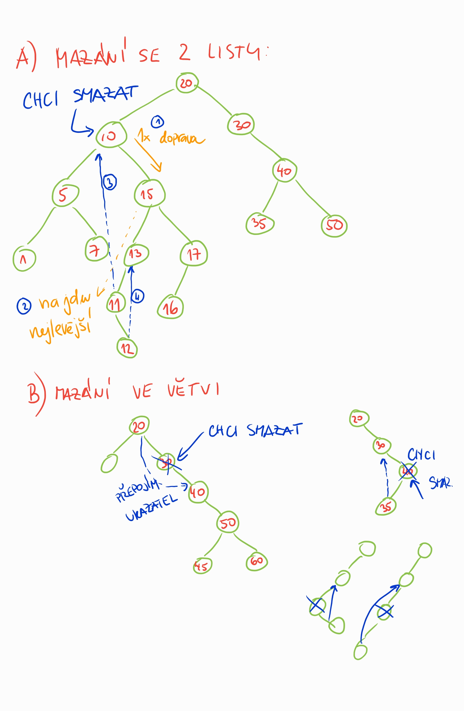

# Cvičení 4 a 5 - Přetěžování operátorů a hluboká kopie

## Záznam cvičení 4

++++
<video width="100%"  controls>
  <source src="https://kmlinux.fjfi.cvut.cz/~pauspetr/video/bipa2-2021-cv04.mp4" type="video/mp4">
</video>
++++
https://kmlinux.fjfi.cvut.cz/~pauspetr/video/bipa2-2021-cv04.mp4

## Záznam cvičení 5

++++
<video width="100%"  controls>
  <source src="https://kmlinux.fjfi.cvut.cz/~pauspetr/video/bipa2-2021-cv05.mp4" type="video/mp4">
</video>
++++
https://kmlinux.fjfi.cvut.cz/~pauspetr/video/bipa2-2021-cv05.mp4

#### Mazání ve stromu, ilustrace

# Původní zadání

V tomto cvičení se seznámíme, jak přetěžovat operátory pro třídy a jak udělat hlubokou kopii objektu s dynamicky alokovanout pamětí.

Doprovodné zdrojové kódy naleznete zde v projektu:
[zdrojáky pro cvičení 4 a 5](https://gitlab.fit.cvut.cz/xchludil-tutorials/pa2/cviceni04-05/tree/master/cviceni04-05-src).

## Zadaní pro společnou práci na cvičení 04

Úkolem je vytvořit třídu `BinTree` pro **binární vyhledávací strom** pro ukládání řetězců `string`,
kde každý element stromu může mít maximálně 2 následníky, levý a pravý.
V levém následníkovi je řetězec menší a v pravém větší (použijte standardní c++ porovnávání řetězců).
U každého řetězce si třída ukládá počet jeho vložení.

Třída musí implementovat následující metody:

<<<<<<< HEAD
*  `add(s, c = 1)`: Metoda vloží do stromu řetězec `s`. Volitelný kladný parametr `c` určuje počet vložení. Např.: `tree.add("jelito");` `tree.add("tlacenka", 2);`.
*  `remove(s)`: Metoda sníží počítadlo výskytů řetězce `s` o 1. Pokud bude počet 0, ze stromu se prvek odstraní. Musí zůstat zachovány nerovnosti ve stromu. Např.: `tree.remove("prejt");`.
*  `toString()`: Metoda převede strom do řetězce ve formátu `string:pocet mezera string:pocet mezera...` a vrátí ho. Např.: `jelito:1 tlacenka:2 `.
*  `clear()`: Metoda vyprázdní strom.
*  `size()`: Metoda vrátí počet skutečně alokovaných listů stromu.
*  Operátor `BinTree[]`: Bude sloužit jako getter pro počet výskytů řetězce v hranatých závorkách. Např.: `unsigned a = tree["ovar"];`. Verzi setter není třeba implementovat.
*  Operátor `BinTree += string`: Přidá řetězec do stromu (viz. `add`). Např.: `tree += "sulc";`.
*  Operátor `BinTree -= string`: Odebere řetězec ze stromu (viz. `remove`). Např.: `tree -= "jitrnice";`.
*  Operátor `BinTree += BinTree`: Sloučí strom s jiným stromem, tj., vloží nové řetězce nebo zvýší počet výskytů. Např.: `tree += tree2;`.
=======
 *  `add(s, c = 1)`: Metoda vloží do stromu řetězec `s`. Volitelný kladný parametr `c` určuje počet vložení. Např.: `tree.add("jelito");` `tree.add("tlacenka", 2);`.
 *  `remove(s)`: Metoda sníží počítadlo výskytů řetězce `s` o 1. Pokud bude počet 0, ze stromu se prvek odstraní. Musí zůstat zachovány nerovnosti ve stromu. Např.: `tree.remove("prejt");`.
 *  `toString()`: Metoda převede strom do řetězce ve formátu `string:pocet mezera string:pocet mezera...` a vrátí ho. Např.: `jelito:1 tlacenka:2 `.
 *  `clear()`: Metoda vyprázdní strom.
 *  `size()`: Metoda vrátí počet skutečně alokovaných listů stromu.
 *  Operátor `BinTree[]`: Bude sloužit jako getter pro počet výskytů řetězce v hranatých závorkách. Např.: `unsigned a = tree["ovar"];`. Verzi setter není třeba implementovat.
 *  Operátor `BinTree += string`: Přidá řetězec do stromu (viz. `add`). Např.: `tree += "sulc";`.
 *  Operátor `BinTree -= string`: Odebere řetězec ze stromu (viz. `remove`). Např.: `tree -= "jitrnice";`.
 *  Operátor `BinTree += BinTree`: Sloučí strom s jiným stromem, tj., vloží nové řetězce nebo zvýší počet výskytů. Např.: `tree += tree2;`.
>>>>>>> 4f80c25774fd60525085c5ef5a61d51485f6824b

Pro svou práci využijte testovací `main.cpp` a předpřipravenou třídu v souborech `bintree.cpp` a `bintree.h`.

## Zadaní pro společnou práci na cvičení 05

Pokračujte v implementaci třídy `BinTree`:

*  Kopírovací konstuktor, který provede hlubokou kopii. Např.: `BinTree t2(tree1);`.
*  Operátor `BinTree = BinTree`: Operátor přiřazení zkopíruje strom na pravé straně na levou (hluboká kopie). Např.: `tree2 = tree1;`.
*  Operátor `BinTree + BinTree`: Sloučí dva stromy a vrátí výsledný strom. Např.: `tree3 = tree1 + tree2;`.
*  Operátor `<<`: Operátor pro výpis do streamu ve stejném formátu jako `toString()`. Např.: `cout << tree;`.
*  Operátor `>>`: Operátor pro vstup ze streamu. Měl by umět zpracovat všechny řetězce ze streamu oddělené bílými znaky najednou. Např.: `cin >> tree`.
